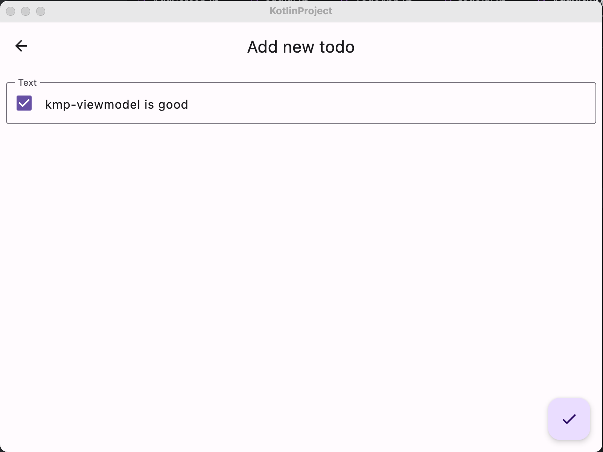
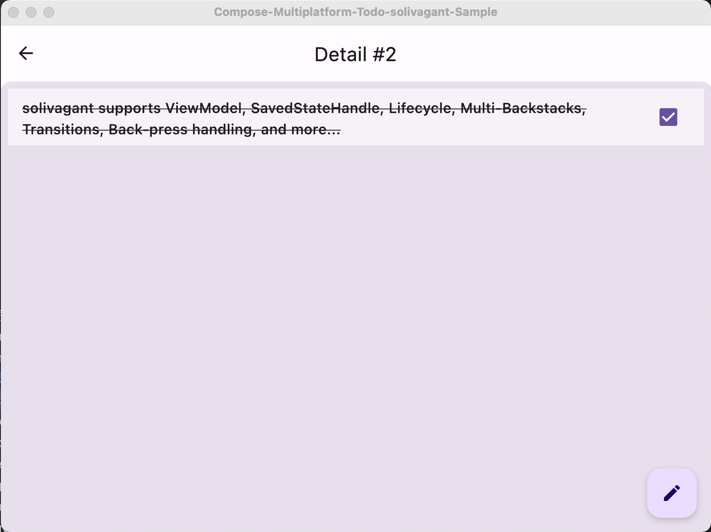
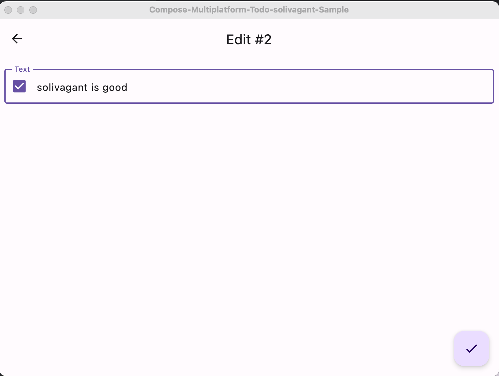
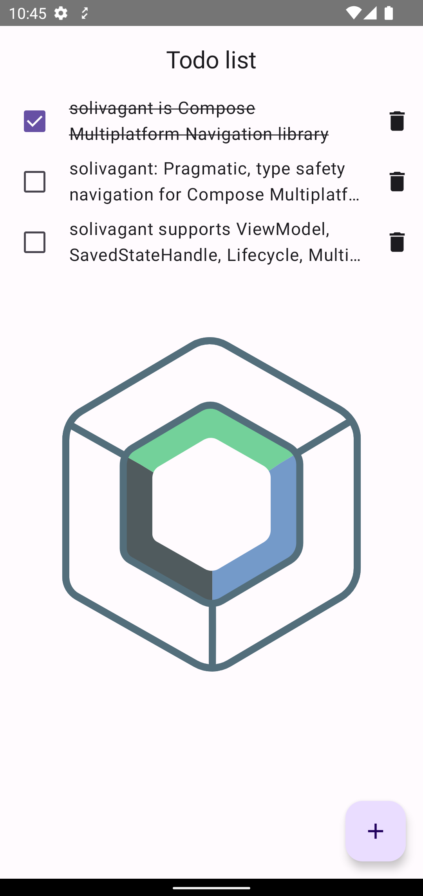
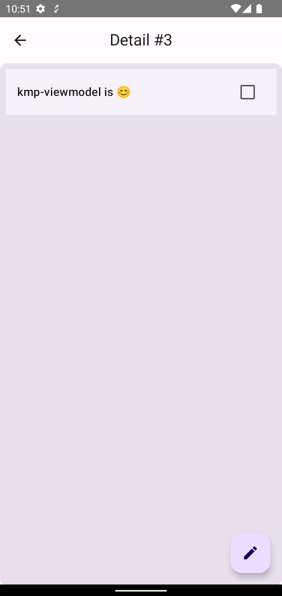
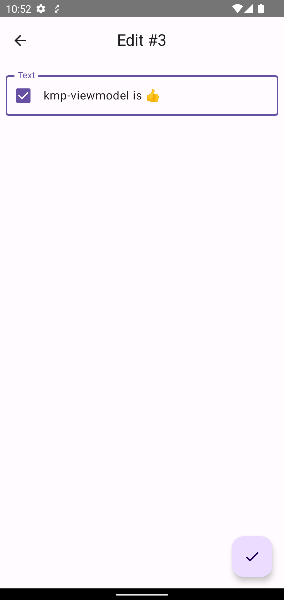

# Compose-Multiplatform-Todo-solivagant-Sample

This repo is a template for getting started with Compose Multiplatform and Kotlin Multiplatform targeting Android, iOS, Web and Desktop.
Compose Multiplatform Navigation and Kotlin Multiplatform ViewModel sample. [solivagant](https://github.com/hoc081098/solivagant) and [kmp-viewmodel](https://github.com/hoc081098/kmp-viewmodel) sample

**[Compose Multiplatform](https://github.com/JetBrains/compose-multiplatform)** sample with
  - https://github.com/hoc081098/kmp-viewmodel: Kotlin Multiplatform ViewModel, SavedStateHandle 🌸
  - https://github.com/hoc081098/solivagant: Compose Multiplatform Navigation 🌼

Like some of my work? Buy me a coffee (or more likely a beer)

### Modern Development

  - Kotlin Multiplatform
  - [JetBrains Compose Multiplatform](https://github.com/JetBrains/compose-multiplatform)
  - [Kotlin Coroutines & Flows](https://github.com/hoc081098/FlowExt)
  - [Koin Dependency Injection](https://github.com/InsertKoinIO/koin)
  - Model-View-Intent (MVI) / FlowRedux state management
  - [Kotlin Multiplatform ViewModel](https://github.com/hoc081098/kmp-viewmodel)
  - Clean Architecture
  - Compose Multiplatform type-safe navigation by [solivagant](https://github.com/hoc081098/solivagant)

## Screenshots

### Desktop

|                       |                       |
|:---------------------:|:---------------------:|
|  |  |
|  |  |

### Android

|                       |                       |                       |                       |
|:---------------------:|:---------------------:|:---------------------:|:---------------------:|
|  |  |  |  |

* `/composeApp` is for code that will be shared across your Compose Multiplatform applications.
  It contains several subfolders:
  - `commonMain` is for code that’s common for all targets.
  - Other folders are for Kotlin code that will be compiled for only the platform indicated in the
    folder name.
    For example, if you want to use Apple’s CoreCrypto for the iOS part of your Kotlin app,
    `iosMain` would be the right folder for such calls.

* `/iosApp` contains iOS applications. Even if you’re sharing your UI with Compose Multiplatform,
  you need this entry point for your iOS app. This is also where you should add SwiftUI code for
  your project.

Learn more
about [Kotlin Multiplatform](https://www.jetbrains.com/help/kotlin-multiplatform-dev/get-started.html),
[Compose Multiplatform](https://github.com/JetBrains/compose-multiplatform/#compose-multiplatform),
[Kotlin/Wasm](https://kotl.in/wasm/)…

**Note:** Compose/Web is Experimental and may be changed at any time. Use it only for evaluation
purposes.
We would appreciate your feedback on Compose/Web and Kotlin/Wasm in the public Slack
channel [#compose-web](https://slack-chats.kotlinlang.org/c/compose-web).
If you face any issues, please report them
on [GitHub](https://github.com/JetBrains/compose-multiplatform/issues).

You can open the web application by running the `:composeApp:wasmJsBrowserDevelopmentRun` Gradle
task.
